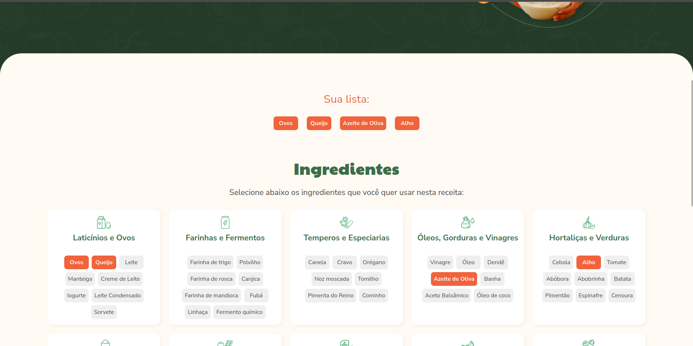
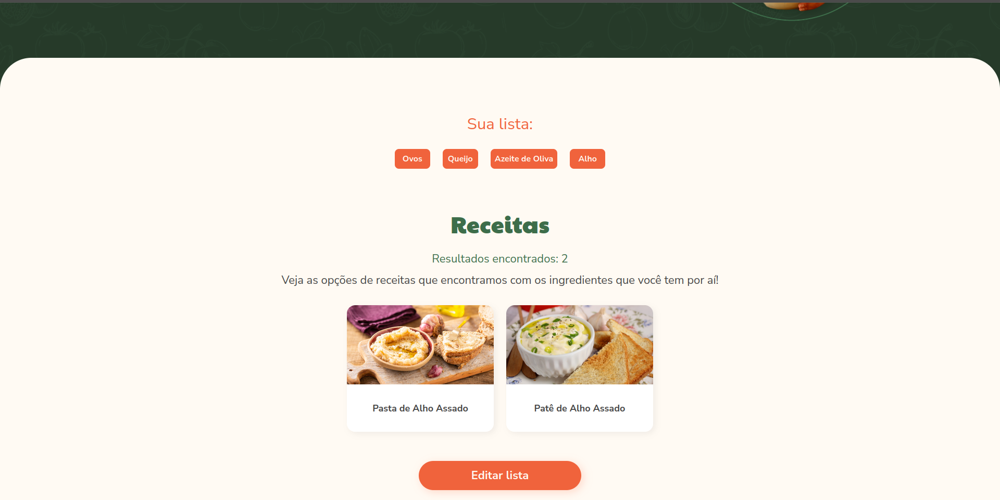

    Conecte-se comigo no linkedin:
    

# Cooking' Up!
Aplicação Vue + Vite para para buscar receitas culinárias (Dados mockados).

# Como rodar
- Tenha o Node v22.12.0 instalado na sua máquina
 - Clone o projeto
 - Abra o terminal na pasta do projeto e execute os comandos:
    - `npm install`
    - `npm run dev`

- Acesse o endereço `http://localhost:5173/` no navegador

# Seções da interface

## Apresentação Inicial

## Seleção de Ingredientes

## Receitas Encontradas
